# ntripcaster

NTRIP v1 caster — Zig rewrite of the BKG reference implementation.

> **Originally developed by BKG (Bundesamt für Geodäsie und Kartographie)**
> as part of the NTRIP protocol reference implementation (NtripCaster 0.1.5).
> Original C source preserved in [`/legacy/`](legacy/).

---

## アーキテクチャ

```mermaid
flowchart TD

subgraph group_runtime["Zig runtime"]
  node_main(("Main<br/>daemon entry<br/>[main.zig]"))
  node_lib["Lib<br/>module facade<br/>[lib.zig]"]
  node_server["Server<br/>listener<br/>[server.zig]"]
  node_auth["Basic auth<br/>access control<br/>[basic.zig]"]
  node_source[("Source stream<br/>mountpoint state<br/>[source.zig]")]
  node_rtcm3["RTCM3<br/>frame parser<br/>[rtcm3.zig]"]
  node_relay{{"Relay engine<br/>fan-out<br/>[engine.zig]"}}
  node_client(("Client<br/>egress session<br/>[client.zig]"))
  node_protocol["Protocol<br/>[protocol.zig]"]
  node_sourcetable["Sourcetable<br/>directory view<br/>[sourcetable.zig]"]
  node_fkp_engine{{"FKP engine<br/>virtual mountpoint<br/>[engine.zig]"}}
  node_fkp_msm7["MSM7<br/>phase extractor<br/>[msm7.zig]"]
  node_fkp_type59["Type 59<br/>encoder<br/>[type59.zig]"]
  node_fkp_bits["Bits<br/>bit helpers<br/>[bits.zig]"]
end

subgraph group_ops["Config & deployment"]
  node_build["Build<br/>[build.zig]"]
  node_config["Config parser<br/>control plane<br/>[parser.zig]"]
  node_log["Logging<br/>observability<br/>[log.zig]"]
end

subgraph group_legacy["Legacy C reference"]
  node_legacy_main(("Legacy main<br/>C daemon<br/>[main.c]"))
  node_legacy_source["Legacy source<br/>C source path<br/>[source.c]"]
  node_legacy_client["Legacy client<br/>C client path<br/>[client.c]"]
  node_legacy_log["Legacy log<br/>C logging<br/>[log.c]"]
end

subgraph group_verification["Verification"]
  node_tests["Tests<br/>test suite<br/>[test_all.zig]"]
  node_interop["Interop<br/>e2e script<br/>[test_interop.sh]"]
  node_demo(("FKP demo<br/>tooling<br/>[fkp_demo.zig]"))
end

node_build -->|"builds"| node_main
node_main -->|"assembles"| node_lib
node_main -->|"loads"| node_config
node_main -->|"starts"| node_server
node_main -->|"initializes"| node_log
node_server -->|"checks"| node_auth
node_server -->|"admits"| node_source
node_server -->|"serves"| node_client
node_source -->|"parses"| node_rtcm3
node_source -->|"publishes"| node_relay
node_relay -->|"fans out"| node_client
node_client -->|"speaks"| node_protocol
node_sourcetable -->|"reflects"| node_source
node_fkp_engine -->|"consumes"| node_fkp_msm7
node_fkp_engine -->|"encodes"| node_fkp_type59
node_fkp_type59 -->|"uses"| node_fkp_bits
node_fkp_engine -.->|"aggregates"| node_source
node_fkp_engine -.->|"exposes"| node_client
node_legacy_main -->|"drives"| node_legacy_source
node_legacy_main -->|"drives"| node_legacy_client
node_legacy_main -->|"uses"| node_legacy_log
node_tests -.->|"covers"| node_config
node_tests -.->|"covers"| node_auth
node_tests -.->|"covers"| node_protocol
node_tests -.->|"covers"| node_relay
node_tests -.->|"covers"| node_rtcm3
node_tests -.->|"covers"| node_server
node_tests -.->|"covers"| node_sourcetable
node_tests -.->|"covers"| node_fkp_engine
node_interop -.->|"checks"| node_protocol
node_demo -.->|"exercises"| node_fkp_engine

click node_build "https://github.com/yasunorioi/ntripcaster/blob/master/build.zig"
click node_main "https://github.com/yasunorioi/ntripcaster/blob/master/src/main.zig"
click node_lib "https://github.com/yasunorioi/ntripcaster/blob/master/src/lib.zig"
click node_config "https://github.com/yasunorioi/ntripcaster/blob/master/src/config/parser.zig"
click node_server "https://github.com/yasunorioi/ntripcaster/blob/master/src/server.zig"
click node_auth "https://github.com/yasunorioi/ntripcaster/blob/master/src/auth/basic.zig"
click node_source "https://github.com/yasunorioi/ntripcaster/blob/master/src/ntrip/source.zig"
click node_rtcm3 "https://github.com/yasunorioi/ntripcaster/blob/master/src/ntrip/rtcm3.zig"
click node_relay "https://github.com/yasunorioi/ntripcaster/blob/master/src/relay/engine.zig"
click node_client "https://github.com/yasunorioi/ntripcaster/blob/master/src/ntrip/client.zig"
click node_protocol "https://github.com/yasunorioi/ntripcaster/blob/master/src/ntrip/protocol.zig"
click node_sourcetable "https://github.com/yasunorioi/ntripcaster/blob/master/src/ntrip/sourcetable.zig"
click node_log "https://github.com/yasunorioi/ntripcaster/blob/master/src/log.zig"
click node_fkp_engine "https://github.com/yasunorioi/ntripcaster/blob/master/src/fkp/engine.zig"
click node_fkp_msm7 "https://github.com/yasunorioi/ntripcaster/blob/master/src/fkp/msm7.zig"
click node_fkp_type59 "https://github.com/yasunorioi/ntripcaster/blob/master/src/fkp/type59.zig"
click node_fkp_bits "https://github.com/yasunorioi/ntripcaster/blob/master/src/fkp/bits.zig"
click node_legacy_main "https://github.com/yasunorioi/ntripcaster/blob/master/legacy/src/main.c"
click node_legacy_source "https://github.com/yasunorioi/ntripcaster/blob/master/legacy/src/source.c"
click node_legacy_client "https://github.com/yasunorioi/ntripcaster/blob/master/legacy/src/client.c"
click node_legacy_log "https://github.com/yasunorioi/ntripcaster/blob/master/legacy/src/log.c"
click node_tests "https://github.com/yasunorioi/ntripcaster/blob/master/tests/test_all.zig"
click node_interop "https://github.com/yasunorioi/ntripcaster/blob/master/tests/test_interop.sh"
click node_demo "https://github.com/yasunorioi/ntripcaster/blob/master/tools/fkp_demo.zig"

classDef toneNeutral fill:#f8fafc,stroke:#334155,stroke-width:1.5px,color:#0f172a
classDef toneBlue fill:#dbeafe,stroke:#2563eb,stroke-width:1.5px,color:#172554
classDef toneAmber fill:#fef3c7,stroke:#d97706,stroke-width:1.5px,color:#78350f
classDef toneMint fill:#dcfce7,stroke:#16a34a,stroke-width:1.5px,color:#14532d
classDef toneRose fill:#ffe4e6,stroke:#e11d48,stroke-width:1.5px,color:#881337
classDef toneIndigo fill:#e0e7ff,stroke:#4f46e5,stroke-width:1.5px,color:#312e81
classDef toneTeal fill:#ccfbf1,stroke:#0f766e,stroke-width:1.5px,color:#134e4a
class node_main,node_lib,node_server,node_auth,node_source,node_rtcm3,node_relay,node_client,node_protocol,node_sourcetable,node_fkp_engine,node_fkp_msm7,node_fkp_type59,node_fkp_bits toneBlue
class node_build,node_config,node_log toneAmber
class node_legacy_main,node_legacy_source,node_legacy_client,node_legacy_log toneMint
class node_tests,node_interop,node_demo toneRose
```



## Features

- NTRIP v1 server / source / client relay
- HTTP Basic authentication (sourcetable, per-mountpoint)
- Ring-buffer per source stream (zero-copy relay to multiple clients)
- Connection limit enforcement (max_clients / max_clients_per_source / max_sources)
- Dynamic sourcetable generation from active sources
- RTCM 3 frame analysis (0xD3 sync, CRC-24Q, message type detection)
- FKP (Flächenkorrekturparameter) computation engine for Network RTK
- Cross-compile ready: `x86_64-linux-musl`, `aarch64-linux-musl`, `arm-linux-musleabihf`, `mipsel-linux-musl`
- systemd service unit with hardening options
- Single static binary — no runtime dependencies

## Build

Requires **Zig 0.15.x** (tested with 0.15.2).

```bash
# ネイティブビルド
zig build

# テスト実行
zig build test

# リリースビルド
zig build -Doptimize=ReleaseSafe
```

### クロスコンパイル

```bash
# Raspberry Pi / ARM64 Linux (musl)
zig build -Dtarget=aarch64-linux-musl

# x86_64 Alpine / OpenWrt
zig build -Dtarget=x86_64-linux-musl
```

成果物は `zig-out/bin/ntripcaster` に生成される。

## Install

```bash
# /usr/local/bin + /etc/ntripcaster/conf にインストール
sudo make install

# Debian/Ubuntu パッケージ生成 (.deb)
make deb

# RPM パッケージ生成
make rpm
```

## systemd 運用

```bash
# サービス有効化・起動
sudo systemctl enable ntripcaster
sudo systemctl start ntripcaster

# 状態確認
sudo systemctl status ntripcaster

# ログ確認
sudo journalctl -u ntripcaster -f
```

## 設定ファイル

デフォルト: `/etc/ntripcaster/conf/ntripcaster.conf`

主要設定項目:

| 項目 | デフォルト | 説明 |
|------|-----------|------|
| `port` | `2101` | NTRIP caster ポート番号 |
| `encoder_password` | *(設定必須)* | Source 接続パスワード |
| `server_name` | `localhost` | サーバーホスト名 |
| `location` | *(任意)* | サーバー設置場所 |
| `max_clients` | `100` | 最大クライアント接続数 |
| `max_clients_per_source` | `100` | マウントポイントあたり最大クライアント数 |
| `max_sources` | `40` | 最大ソース接続数 |
| `logdir` | `logs` | ログ出力ディレクトリ |
| `logfile` | `ntripcaster.log` | ログファイル名 |

### FKP 設定

Network RTK の FKP (面補正パラメータ) 計算・配信機能。
3局以上の NTRIP 基準局から搬送波位相データを取得し、FKP を計算して仮想マウントポイントとして配信する。

```conf
# FKP 有効化（デフォルト: false）
fkp_enable true

# 上流基準局（3局以上必須）
# 書式: fkp_source host/mountpoint [user:password]
# ポート変更時: fkp_source host:port/mountpoint [user:password]
fkp_source ntrip.hogehoge.com/BASE01 user@example.com:pass
fkp_source ntrip.hogehoge.com/BASE02 user@example.com:pass
fkp_source ntrip.hogehoge.com/BASE03 user@example.com:pass

# FKP 配信マウントポイント名
fkp_mountpoint /FKP_REGION

# FKP 計算間隔（秒、デフォルト: 1）
fkp_interval 1
```

詳細は [`conf/ntripcaster.conf`](conf/ntripcaster.conf) を参照。

## Architecture

```
Source (NTRIP source device)
  │  SOURCE /mountpoint HTTP/1.0
  ▼
[server.zig] accept + auth/basic + connection limit check
  │
  ▼
[ntrip/source.zig]  ← mountpoint registration + RTCM3 frame analysis
  │
  ▼
[ntrip/sourcetable.zig]  ← dynamic sourcetable (active sources + format-details)
  │
  ▼
[RingBuffer per source]  ← relay/ring_buffer.zig
  │
  ├─▶ Client 1 (GET /mountpoint)
  ├─▶ Client 2
  └─▶ Client N

FKP Engine (optional):
  [NTRIP sources] ──▶ [fkp/msm7.zig] ──▶ [fkp/engine.zig] ──▶ [fkp/type59.zig]
   3+ base stations    MSM7 phase        FKP computation       RTCM Type 59
                       extraction        (Tanaka 2003)         encoding
                                              │
                                              ▼
                                     Virtual mountpoint (/FKP_*)
```

詳細: [`docs/ARCHITECTURE.md`](docs/ARCHITECTURE.md)

## References

- 田中慎治 (2003)「ネットワークRTK-GPS測位に関する研究」東京商船大学（現 東京海洋大学）修士論文
  - FKP 計算式: §4.3.3–4.3.4 (pp.51–57)

## Legacy C Implementation

`/legacy/` に BKG 原典 (NtripCaster 0.1.5, C言語) を保存。
プロトコル仕様・設定書式の照合ベースラインとして利用。

→ [`legacy/README.md`](legacy/README.md)

## License

GNU General Public License v2.0 — see [LICENSE](LICENSE).

Original NtripCaster: © BKG (Bundesamt für Geodäsie und Kartographie), Frankfurt, Germany.
Zig rewrite: © yasunorioi.
