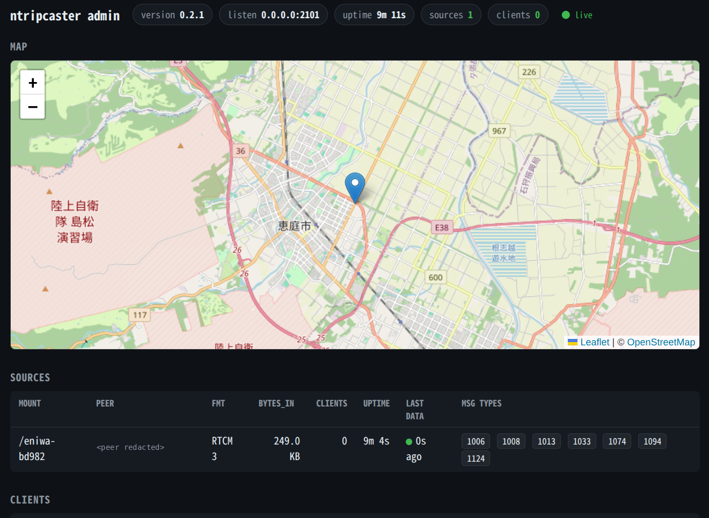

# ntripcaster

📖 **English README**: [README.en.md](README.en.md)

NTRIP v1 / v2 caster — Zig rewrite of the BKG reference implementation, with
an original FKP / VRS Network RTK engine layered on top (not in BKG 0.1.5).

> **Originally developed by BKG (Bundesamt für Geodäsie und Kartographie)**
> as part of the NTRIP protocol reference implementation (NtripCaster 0.1.5).
> The C source itself is no longer mirrored in this repo — git history
> through commit `753253f` still contains it under `/legacy/`, and the
> upstream BKG release remains the canonical source.

---

## アーキテクチャ


```mermaid
flowchart TD

subgraph group_runtime["Zig runtime"]
  node_main(("Main<br/>daemon entry<br/>[main.zig]"))
  node_lib["Lib<br/>module facade<br/>[lib.zig]"]
  node_server["Server<br/>listener<br/>[server.zig]"]
  node_auth["Basic auth<br/>access control<br/>[basic.zig]"]
  node_source[("Source stream<br/>mountpoint state<br/>[source.zig]")]
  node_rtcm3["RTCM3<br/>frame parser<br/>[rtcm3.zig]"]
  node_relay{{"Relay engine<br/>fan-out<br/>[engine.zig]"}}
  node_client(("Client<br/>egress session<br/>[client.zig]"))
  node_protocol["Protocol<br/>[protocol.zig]"]
  node_sourcetable["Sourcetable<br/>directory view<br/>[sourcetable.zig]"]
  node_fkp_engine{{"FKP engine<br/>compute params<br/>[fkp/engine.zig]"}}
  node_fkp_msm7["MSM7<br/>phase extractor<br/>[fkp/msm7.zig]"]
  node_fkp_type59["Type 59<br/>encoder<br/>[fkp/type59.zig]"]
  node_fkp_bits["Bits<br/>bit helpers<br/>[fkp/bits.zig]"]
  node_fkp_upstream(("Upstream<br/>NTRIP rover<br/>[fkp/upstream.zig]"))
  node_fkp_runtime{{"FKP runtime<br/>orchestrator<br/>[fkp/runtime.zig]"}}
end

subgraph group_admin["Admin HTTP / UI"]
  node_admin_server["Admin server<br/>HTTP + SSE<br/>[admin/server.zig]"]
  node_admin_stats["Stats<br/>JSON serializer<br/>[admin/stats.zig]"]
  node_admin_ui(("Dashboard<br/>embedded HTML/JS<br/>[admin/index.html]"))
end

subgraph group_ops["Config & deployment"]
  node_build["Build<br/>[build.zig]"]
  node_config["Config parser<br/>control plane<br/>[parser.zig]"]
  node_log["Logging<br/>observability<br/>[log.zig]"]
end

subgraph group_verification["Verification"]
  node_tests["Tests<br/>test suite<br/>[test_all.zig]"]
  node_interop["Interop<br/>e2e script<br/>[test_interop.sh]"]
  node_demo(("FKP demo<br/>tooling<br/>[fkp_demo.zig]"))
end

node_build -->|"builds"| node_main
node_main -->|"assembles"| node_lib
node_main -->|"loads"| node_config
node_main -->|"starts"| node_server
node_main -->|"initializes"| node_log
node_server -->|"checks"| node_auth
node_server -->|"admits"| node_source
node_server -->|"serves"| node_client
node_source -->|"parses"| node_rtcm3
node_source -->|"publishes"| node_relay
node_relay -->|"fans out"| node_client
node_client -->|"speaks"| node_protocol
node_sourcetable -->|"reflects"| node_source
node_fkp_engine -->|"consumes"| node_fkp_msm7
node_fkp_engine -->|"encodes"| node_fkp_type59
node_fkp_type59 -->|"uses"| node_fkp_bits
node_main -->|"spawns"| node_fkp_runtime
node_fkp_runtime -->|"connects via"| node_fkp_upstream
node_fkp_upstream -->|"extracts via"| node_fkp_msm7
node_fkp_runtime -->|"computes via"| node_fkp_engine
node_fkp_runtime -->|"registers virtual"| node_source
node_fkp_runtime -->|"writes via"| node_relay
node_main -->|"spawns"| node_admin_server
node_admin_server -->|"snapshots"| node_server
node_admin_server -->|"serializes via"| node_admin_stats
node_admin_server -->|"serves"| node_admin_ui
node_tests -.->|"covers"| node_config
node_tests -.->|"covers"| node_auth
node_tests -.->|"covers"| node_protocol
node_tests -.->|"covers"| node_relay
node_tests -.->|"covers"| node_rtcm3
node_tests -.->|"covers"| node_server
node_tests -.->|"covers"| node_sourcetable
node_tests -.->|"covers"| node_fkp_engine
node_interop -.->|"checks"| node_protocol
node_demo -.->|"exercises"| node_fkp_engine

click node_build "https://github.com/yasunorioi/ntripcaster/blob/master/build.zig"
click node_main "https://github.com/yasunorioi/ntripcaster/blob/master/src/main.zig"
click node_lib "https://github.com/yasunorioi/ntripcaster/blob/master/src/lib.zig"
click node_config "https://github.com/yasunorioi/ntripcaster/blob/master/src/config/parser.zig"
click node_server "https://github.com/yasunorioi/ntripcaster/blob/master/src/server.zig"
click node_auth "https://github.com/yasunorioi/ntripcaster/blob/master/src/auth/basic.zig"
click node_source "https://github.com/yasunorioi/ntripcaster/blob/master/src/ntrip/source.zig"
click node_rtcm3 "https://github.com/yasunorioi/ntripcaster/blob/master/src/ntrip/rtcm3.zig"
click node_relay "https://github.com/yasunorioi/ntripcaster/blob/master/src/relay/engine.zig"
click node_client "https://github.com/yasunorioi/ntripcaster/blob/master/src/ntrip/client.zig"
click node_protocol "https://github.com/yasunorioi/ntripcaster/blob/master/src/ntrip/protocol.zig"
click node_sourcetable "https://github.com/yasunorioi/ntripcaster/blob/master/src/ntrip/sourcetable.zig"
click node_log "https://github.com/yasunorioi/ntripcaster/blob/master/src/log.zig"
click node_fkp_engine "https://github.com/yasunorioi/ntripcaster/blob/master/src/fkp/engine.zig"
click node_fkp_msm7 "https://github.com/yasunorioi/ntripcaster/blob/master/src/fkp/msm7.zig"
click node_fkp_type59 "https://github.com/yasunorioi/ntripcaster/blob/master/src/fkp/type59.zig"
click node_fkp_bits "https://github.com/yasunorioi/ntripcaster/blob/master/src/fkp/bits.zig"
click node_fkp_upstream "https://github.com/yasunorioi/ntripcaster/blob/master/src/fkp/upstream.zig"
click node_fkp_runtime "https://github.com/yasunorioi/ntripcaster/blob/master/src/fkp/runtime.zig"
click node_tests "https://github.com/yasunorioi/ntripcaster/blob/master/tests/test_all.zig"
click node_interop "https://github.com/yasunorioi/ntripcaster/blob/master/tests/test_interop.sh"
click node_demo "https://github.com/yasunorioi/ntripcaster/blob/master/tools/fkp_demo.zig"
click node_admin_server "https://github.com/yasunorioi/ntripcaster/blob/master/src/admin/server.zig"
click node_admin_stats "https://github.com/yasunorioi/ntripcaster/blob/master/src/admin/stats.zig"
click node_admin_ui "https://github.com/yasunorioi/ntripcaster/blob/master/src/admin/index.html"

classDef toneNeutral fill:#f8fafc,stroke:#334155,stroke-width:1.5px,color:#0f172a
classDef toneBlue fill:#dbeafe,stroke:#2563eb,stroke-width:1.5px,color:#172554
classDef toneAmber fill:#fef3c7,stroke:#d97706,stroke-width:1.5px,color:#78350f
classDef toneMint fill:#dcfce7,stroke:#16a34a,stroke-width:1.5px,color:#14532d
classDef toneRose fill:#ffe4e6,stroke:#e11d48,stroke-width:1.5px,color:#881337
classDef toneIndigo fill:#e0e7ff,stroke:#4f46e5,stroke-width:1.5px,color:#312e81
classDef toneTeal fill:#ccfbf1,stroke:#0f766e,stroke-width:1.5px,color:#134e4a
class node_main,node_lib,node_server,node_auth,node_source,node_rtcm3,node_relay,node_client,node_protocol,node_sourcetable,node_fkp_engine,node_fkp_msm7,node_fkp_type59,node_fkp_bits,node_fkp_upstream,node_fkp_runtime toneBlue
class node_admin_server,node_admin_stats,node_admin_ui toneIndigo
class node_build,node_config,node_log toneAmber
class node_tests,node_interop,node_demo toneRose
```

## Features

- NTRIP v1 / v2 server / source / client relay
- HTTP Basic authentication (per-mountpoint, plus `default_mount_access deny|open`)
- Ring-buffer per source stream (1 MB, RwLock 分離 — 100+ rover 同時 read を並列化、`tools/stress.py` で 100 client × 5 min soak 実証済)
- Connection limit enforcement (max_clients / max_clients_per_source / max_sources)
- Sourcetable fully auto-generated: CAS / NET 行は設定ファイルから組み立て、STR 行は live source から動的生成（手書き `sourcetable.dat` 不要）
- RTCM 3 frame analysis (0xD3 sync, CRC-24Q, message type detection, 1005/1006 antenna-ref-point lat/lon 抽出)
- **Harsh-conditions hardening** (農機 / LTE / Starlink 想定): client + source 両側に `SO_KEEPALIVE` + `SO_SNDTIMEO` を適用、source の half-open 接続は約 75 秒で kernel 検出。同名 mount への新 SOURCE/POST 接続が来て認証を通過したら **takeover**: 旧接続が `SOURCE_TAKEOVER_IDLE_MS` (3 秒) 以上 idle なら即 evict し reconnect を 0 秒で通す。reboot/瞬断の zombie は必ずこの grace を超えるので即 reclaim、逆に 1Hz で streaming 中の現役 source は idle が grace 未満で evict されず、2 基準局を同 mount に誤設定しても無限フラップしない
- **FKP (Flächenkorrekturparameter) live service** — 3+ NTRIP 上流に接続し、主上流の生 RTCM3 + 定期注入 Type 59 を仮想 mountpoint として配信 (Network RTK)
- **Admin UI + JSON API** (`/api/v1/{status,sources,clients,events}`) with SSE live updates and embedded vanilla-JS dashboard + Leaflet/OSM 基準局マップ + source-offline 赤バナー
- Per-connection telemetry: peer address, bytes_in/out, started_at, last_data_at, per-source RTCM3 message-type counts, BufferOverrun 切断回数
- Cross-compile ready: `x86_64-linux-musl`, `aarch64-linux-musl`, `arm-linux-musleabihf`, `mipsel-linux-musl`
- systemd service unit with hardening options
- Single static binary — no runtime dependencies

## Build

Requires **Zig 0.15.x** (tested with 0.15.2). `build.zig` 先頭で 0.16+ は
`@compileError` で弾きます。理由は下記「Zig 0.16+ について」を参照。

```bash
# ネイティブビルド
zig build

# テスト実行
zig build test

# リリースビルド
zig build -Doptimize=ReleaseSafe
```

### Zig 0.16+ について

Zig 0.16 で `std.Thread.Mutex` → `std.Io.Mutex`、`std.net` → `std.Io.net`
など同期/ネットワーク API が新 `std.Io` interface 経由に統一されたため、
本プロジェクトの ServerState / Source / Relay / FKP runtime に `*std.Io`
を貫通させる大規模リファクタが必要になります。0.17 でも同じ設計が続く
ため (release notes 確認済み)、当面は 0.15.x で運用します。

#### snap で 0.16 が入ってしまった場合 (Debian/Ubuntu)

snap zig は beta チャネルのみで 0.15.x が降りてこないので、公式 tarball
への切り替えを推奨:

```bash
sudo snap remove zig
mkdir -p ~/.local/zig ~/.local/bin
cd ~/.local/zig
wget https://ziglang.org/download/0.15.2/zig-x86_64-linux-0.15.2.tar.xz
tar xf zig-x86_64-linux-0.15.2.tar.xz
ln -sf ~/.local/zig/zig-x86_64-linux-0.15.2/zig ~/.local/bin/zig
# PATH に ~/.local/bin が無ければ:
echo 'export PATH=$HOME/.local/bin:$PATH' >> ~/.bashrc && source ~/.bashrc
zig version    # → 0.15.2
```

### クロスコンパイル

```bash
# Raspberry Pi / ARM64 Linux (musl)
zig build -Dtarget=aarch64-linux-musl

# x86_64 Alpine / OpenWrt
zig build -Dtarget=x86_64-linux-musl
```

成果物は `zig-out/bin/ntripcaster` に生成される。

## Install

3 ルートあります。**(A) パッケージインストール** が本流、(B) は手動セットアップ、(C) は BKG 0.1.5 C 版から移行する場合の注意。

### (A) パッケージインストール (推奨)

ビルド + .deb / .rpm / .ipk 生成して配布:

```bash
# Debian/Ubuntu パッケージ (.deb)
make package-deb ARCH=amd64

# RPM パッケージ
make package-rpm ARCH=x86_64

# OpenWrt パッケージ (.ipk)
make package-opkg ARCH=x86_64

# 上記 3 つをまとめて
make packages
```

成果物は `*.deb` / `*.rpm` / `*.ipk` としてリポジトリルートに出力される。
`ARCH` を省略すると `dpkg --print-architecture` の結果 (なければ `amd64`) が使われる。

`.deb` の install layout (postinst が `ntripcaster:ntripcaster` システム
ユーザ作成 + log dir 作成 + service enable まで自動):

| パス | 内容 |
|---|---|
| `/usr/local/bin/ntripcaster` | バイナリ |
| `/etc/ntripcaster/ntripcaster.conf` | 設定 (conffile、上書き不可) |
| `/usr/share/doc/ntripcaster/ntripcaster.conf.example` | 設定リファレンス |
| `/lib/systemd/system/ntripcaster.service` | systemd unit |
| `/var/log/ntripcaster/` | ログディレクトリ |

```bash
sudo dpkg -i ntripcaster_0.5.0_amd64.deb
sudo systemctl start ntripcaster   # enable は postinst が済ませる
```

### (B) ソースビルド + 手動セットアップ

パッケージを作らず直接配置したい場合:

```bash
# 1. ビルド
zig build -Doptimize=ReleaseSafe
sudo install -m 755 zig-out/bin/ntripcaster /usr/local/bin/ntripcaster

# 2. 設定
sudo mkdir -p /etc/ntripcaster
sudo cp conf/ntripcaster.conf /etc/ntripcaster/ntripcaster.conf
sudo $EDITOR /etc/ntripcaster/ntripcaster.conf    # encoder_password 等を変更

# 3. システムユーザ + log dir
sudo useradd -r -s /usr/sbin/nologin -d /var/empty ntripcaster
sudo mkdir -p /var/log/ntripcaster
sudo chown ntripcaster:ntripcaster /var/log/ntripcaster
sudo chown -R ntripcaster:ntripcaster /etc/ntripcaster

# 4. systemd unit (リポジトリの ntripcaster.service をそのまま使える)
sudo install -m 644 ntripcaster.service /etc/systemd/system/ntripcaster.service
sudo systemctl daemon-reload
sudo systemctl enable --now ntripcaster
```

### (C) レガシー C 版からの移行注意

BKG 原典の C 版 (NtripCaster 0.1.5) を以前 `./configure
--prefix=/usr/local/ntripcaster && make install` で入れている場合、新
Zig 版とパスが完全に分かれます:

- C 版: `/usr/local/ntripcaster/bin/ntripcaster` + `/usr/local/ntripcaster/conf/`
- Zig 版: `/usr/local/bin/ntripcaster` + `/etc/ntripcaster/`

両方残ると systemd unit がどちらを叩いているか混乱するので、Zig 版に切り
替えるときは:

```bash
sudo systemctl stop ntripcaster
sudo systemctl disable ntripcaster
# Zig 版の unit / バイナリを (A) または (B) で入れた上で
sudo systemctl daemon-reload
sudo systemctl enable --now ntripcaster
# 旧 C 版の install tree は念のため保管 (削除する場合は中身確認後に)
sudo mv /usr/local/ntripcaster /usr/local/ntripcaster.legacy.bak
```

## systemd 運用

```bash
# サービス有効化・起動
sudo systemctl enable ntripcaster
sudo systemctl start ntripcaster

# 状態確認
sudo systemctl status ntripcaster

# ログ確認
sudo journalctl -u ntripcaster -f
```

## 設定ファイル

デフォルト: `/etc/ntripcaster/ntripcaster.conf`

主要設定項目:

| 項目 | デフォルト | 説明 |
|------|-----------|------|
| `port` | `2101` | NTRIP caster ポート番号 |
| `encoder_password` | *(設定必須)* | Source 接続パスワード |
| `server_name` | `localhost` | サーバーホスト名 |
| `location` | *(任意)* | サーバー設置場所 |
| `max_clients` | `100` | 最大クライアント接続数 |
| `max_clients_per_source` | `100` | マウントポイントあたり最大クライアント数 |
| `max_sources` | `40` | 最大ソース接続数 |
| `logdir` | `logs` | ログ出力ディレクトリ |
| `logfile` | `ntripcaster.log` | ログファイル名 |
| `admin_enable` | `true` | 管理 UI / API リスナーを起動 |
| `admin_bind` | `127.0.0.1` | 管理リスナーのバインドアドレス |
| `admin_port` | `8080` | 管理リスナーのポート |
| `admin_user` | *(空)* | Basic 認証ユーザー（空なら認証無効） |
| `admin_password` | *(空)* | Basic 認証パスワード |
| `default_mount_access` | `deny` | `/MOUNT` 行が無い mount への client GET 既定挙動 (`deny` / `open`) |

### マウントポイント

マウントポイントは config から読まれる静的設定 (ランタイム追加 API は未実装)。
**source 側 / client 側で扱いが分かれます。**

#### source 側 (基準局 push)

config 編集不要。`encoder_password` さえ合っていれば、基準局が `SOURCE
{pw} /MOUNT` (v1) または `POST /MOUNT HTTP/1.1` + `Authorization: Basic
...` (v2) で接続した瞬間に mount が生え、`/api/v1/sources` と sourcetable
の STR 行に自動で出ます。Type 1005 / 1006 を送れば admin UI の地図にも
ピンが立ちます。

#### client 側 (rover 受信) のアクセス制御

`/MOUNT` 行を `ntripcaster.conf` に書き足して `systemctl restart` する:

```ini
# オープンマウント (誰でも GET 可)
/eniwa-hogehoge333

# 認証付き (rover が NTRIP Basic auth で user:pass を送る)
/eniwa-hogehoge333:rover1:pw1,rover2:pw2
```

config の hot-reload は無く、起動時のみ読まれます。

**`/MOUNT` 行が config に無い mount を source が push したとき**の挙動は
`default_mount_access` で制御:

| 値 | 動作 |
|---|---|
| `deny` (default) | config 未登録 mount への client GET は **401** で蹴る (NTRIP 規格的に明示主義) |
| `open` | config 未登録 mount でも **誰でも GET 可** (source が push さえすれば自動公開) |

```ini
# source が連れて来たマウントを自動的にオープン公開したい運用向け
default_mount_access open
```

`/MOUNT` や `/MOUNT:user:pass` で明示された mount はこの設定に関わらず
個別行の設定が優先されます。

#### 命名規則

`mount` 名はただの opaque な文字列で、NTRIP 規格上の文字数/大文字小文字
強制はありません。実用上の制約だけ:

- 先頭 `/` 必須 (HTTP path として扱われる)
- `:` 禁止 (`/MOUNT:user:pass` の区切りと衝突)
- 空白 / `?` / `#` / `&` 禁止 (URL として安全でない)
- 大文字小文字は区別される

例: `/eniwa-bd982`, `/eniwa-hogehoge333`, `/BASE01`, `/farm-A_blockN`

#### 接続方法まとめ

| 役割 | NTRIP v1 | NTRIP v2 |
|---|---|---|
| Source push | `SOURCE {pw} /MOUNT` | `POST /MOUNT HTTP/1.1` + Basic auth |
| Client read | `GET /MOUNT HTTP/1.0` | `GET /MOUNT HTTP/1.1` + `Ntrip-Version: Ntrip/2.0` |

### FKP 設定

Network RTK の FKP (面補正パラメータ) 計算・配信機能。
3局以上の NTRIP 基準局から搬送波位相データを取得し、FKP を計算して仮想マウントポイントとして配信する。

```conf
# FKP 有効化（デフォルト: false）
fkp_enable true

# 上流基準局（3局以上必須）
# 書式: fkp_source host/mountpoint [user:password]
# ポート変更時: fkp_source host:port/mountpoint [user:password]
fkp_source ntrip.hogehoge.com/BASE01 user@example.com:pass
fkp_source ntrip.hogehoge.com/BASE02 user@example.com:pass
fkp_source ntrip.hogehoge.com/BASE03 user@example.com:pass

# FKP 配信マウントポイント名
fkp_mountpoint /FKP_REGION

# FKP 計算間隔（秒、デフォルト: 1）
fkp_interval 1
```

詳細は [`conf/ntripcaster.conf`](conf/ntripcaster.conf) を参照。

### FKP runtime の動作

`fkp_enable=true` かつ `fkp_sources` が 3 局以上、かつ `fkp_mountpoint` が指定されているとき、起動時に **FKP runtime** スレッド (`src/fkp/runtime.zig`) が立ち上がる:

1. **上流接続維持**: 各 `fkp_source` に対して `src/fkp/upstream.zig` の `Upstream` が NTRIP GET 接続を張る (指数バックオフ再接続付き)。各上流の RTCM3 を継続的に受信し、1005/1006 を見つけたら基準局座標を保存、1077/1087/1097 (MSM7) を見つけたら搬送波位相を蓄積する。
2. **主上流パススルー**: `fkp_sources[0]` (主上流) からの生 RTCM3 バイトを **そのまま** 仮想 mountpoint (`fkp_mountpoint`) の `RingBuffer` に流す。下流クライアントは通常の NTRIP GET でこの mountpoint に subscribe するだけで、主上流の MSM7/1005/ephemeris 等が透過的に届く。
3. **FKP 計算 + Type 59 注入**: `fkp_interval` 秒ごとに 3 局以上のスナップショットを取り、`fkp/engine.zig::computeFkp()` で N_I/E_I/N_0/E_0 を算出 → `fkp/type59.zig::encodeType59()` でフレーム化 → 同じ仮想 mountpoint に注入する。

結果として、rover は単一の mountpoint (`GET /FKP_REGION`) で主上流の生 RTCM3 + FKP 補正の両方を受け取る、Network RTK サービスとして機能する完全な配信になる。

ローカル動作確認:

```bash
zig build
./zig-out/bin/ntripcaster -c conf/ntripcaster.conf &
nc localhost 2101 < /dev/null  # SOURCETABLE 取得で /FKP_REGION が STR 行として出るか確認
```

仮想 mountpoint は通常の Source と同じく `/api/v1/sources` にも出る (peer は 0.0.0.0:0、bytes_in は累積、msg_types に 59 + 主上流のメッセージタイプ)。

## 管理 UI / API

NTRIP リスナーとは別ポートで観測用 HTTP サーバーが起動する（既定: `127.0.0.1:8080`）。
ブラウザで `http://127.0.0.1:8080/` を開くと、SSE で 1 秒ごとに自動更新されるダッシュボードが表示される。



ダッシュボードは Status / Sources / Clients テーブルに加えて、接続中
source が RTCM 3 Type 1005 / 1006 を送ってきた場合に **Leaflet + OSM タイル
で基準局位置にピン**を立てる。

### エンドポイント

| メソッド | パス | 用途 |
|---------|------|------|
| `GET` | `/` | 管理 UI（HTML、バイナリに `@embedFile` 同梱） |
| `GET` | `/api/v1/status` | バージョン / uptime / listen / sources / clients |
| `GET` | `/api/v1/sources` | 接続中ソース一覧（peer / bytes_in / msg_types / 時刻） |
| `GET` | `/api/v1/clients` | 接続中クライアント一覧（id / peer / mount / bytes_out / 時刻） |
| `GET` | `/api/v1/events` | SSE。`text/event-stream` で 1 秒ごとに composite snapshot を配信 |

### 認証

`admin_user` を設定すると HTTP Basic 認証が有効になる。空のままなら認証無効。

```conf
admin_bind 127.0.0.1
admin_port 8080
admin_user admin
admin_password s3cret
```

> `admin_bind` を `0.0.0.0` にする場合は **必ず** `admin_user` / `admin_password` を設定すること。
> 既定のループバック限定 (`127.0.0.1`) 運用なら認証なしでも安全。

### サンプル

```bash
# 概要
curl -s http://127.0.0.1:8080/api/v1/status | jq

# 接続中ソース
curl -s http://127.0.0.1:8080/api/v1/sources | jq

# ライブ配信（Ctrl-C で抜ける）
curl -N http://127.0.0.1:8080/api/v1/events
```

`status` レスポンス例:

```json
{
  "version": "0.2.1",
  "started_at_ms": 1778435211631,
  "now_ms": 1778435214637,
  "uptime_ms": 3006,
  "sources": 0,
  "clients": 0,
  "listen": "0.0.0.0:2101"
}
```

`sources` レスポンス例:

```json
[{
  "mount": "/BASE01",
  "peer": "127.0.0.1:56540",
  "rtcm_detected": true,
  "client_count": 1,
  "bytes_in": 12345,
  "started_at_ms": 1778435019192,
  "last_data_at_ms": 1778435021013,
  "msg_types": [{"type": 1005, "count": 10}, {"type": 1077, "count": 25}]
}]
```

## Architecture

```
Source (NTRIP source device)
  │  SOURCE /mountpoint HTTP/1.0
  ▼
[server.zig] accept + auth/basic + connection limit check
  │
  ▼
[ntrip/source.zig]  ← mountpoint registration + RTCM3 frame analysis
  │
  ▼
[ntrip/sourcetable.zig]  ← dynamic sourcetable (active sources + format-details)
  │
  ▼
[RingBuffer per source]  ← relay/ring_buffer.zig
  │
  ├─▶ Client 1 (GET /mountpoint)
  ├─▶ Client 2
  └─▶ Client N

FKP Engine (optional):
  [NTRIP sources] ──▶ [fkp/msm7.zig] ──▶ [fkp/engine.zig] ──▶ [fkp/type59.zig]
   3+ base stations    MSM7 phase        FKP computation       RTCM Type 59
                       extraction        (Tanaka 2003)         encoding
                                              │
                                              ▼
                                     Virtual mountpoint (/FKP_*)

Admin HTTP (default 127.0.0.1:8080, separate listener thread):
  Browser ──▶ GET /                 ──▶ [admin/server.zig] ──▶ embedded index.html
          ──▶ GET /api/v1/{...}     ──▶ snapshotSources/Clients ──▶ [admin/stats.zig] JSON
          ──▶ GET /api/v1/events    ──▶ SSE loop (1s tick, composite snapshot)
```

詳細: [`docs/ARCHITECTURE.md`](docs/ARCHITECTURE.md)

## Stress test

`tools/stress.py` は asyncio で 1 プロセス内に並列接続を貼って 3 フェーズの
耐久確認をする (`max_clients_per_source` 制限 → connect storm → 5分 soak)。

```bash
ADMIN_USER=admin ADMIN_PW=… python3 tools/stress.py
```

実測値 (default config: `max_clients=100`、1 mount = `/eniwa-bd982` から
Trimble BD982 が MSM7 multi-GNSS を ~470 B/sec で push):

| Phase | 設定 | 結果 |
|---|---|---|
| 1. limit enforcement | 110 client × 30s hold | 98 connect / 12 `503 Too Many Clients`、bytes 1.39 MB (≒ 14 KB/client) |
| 2. connect storm | 200 client × 2s hold | 200 全部 503 ← Phase 1 の 99 がまだ drain 中、graceful 過負荷 ✓ |
| 3. soak | 50 client × 5 min | 50 connect 維持、bytes 6.99 MB、RSS フラット (3.4 MB)、`err_bad_status=0`、`BufferOverrun=0` |

100 同時 client + 5 分 soak で安定。リーク無し。`max_clients` を 150 程度に
上げると reconnect 余裕も含めて農機 100 台運用想定が安全圏。

## References

- 田中慎治 (2003)「ネットワークRTK-GPS測位に関する研究」東京商船大学（現 東京海洋大学）修士論文
  - FKP 計算式: §4.3.3–4.3.4 (pp.51–57)

## License

GNU General Public License v2.0 — see [LICENSE](LICENSE).

Original NtripCaster: © BKG (Bundesamt für Geodäsie und Kartographie), Frankfurt, Germany.
Zig rewrite: © yasunorioi.
